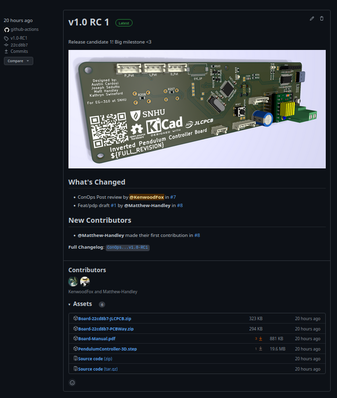
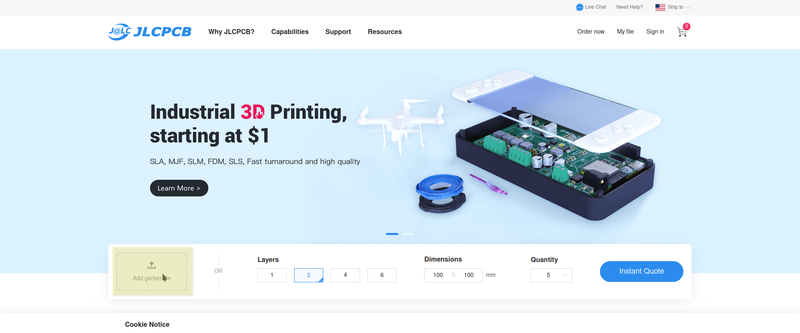
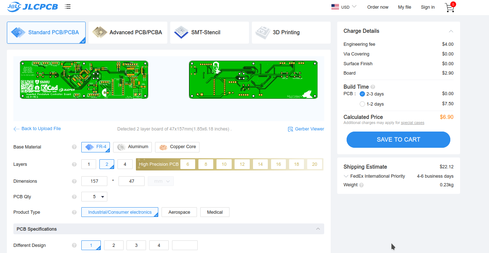
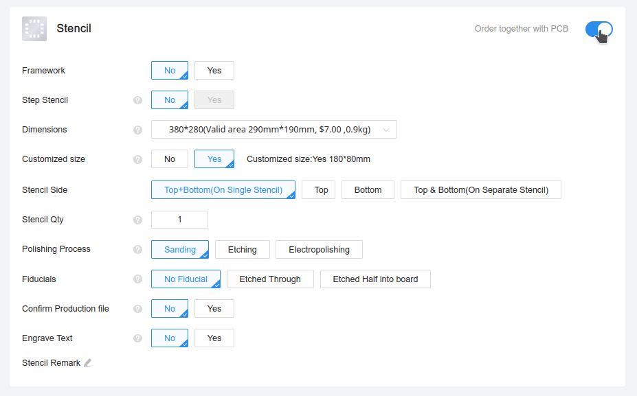
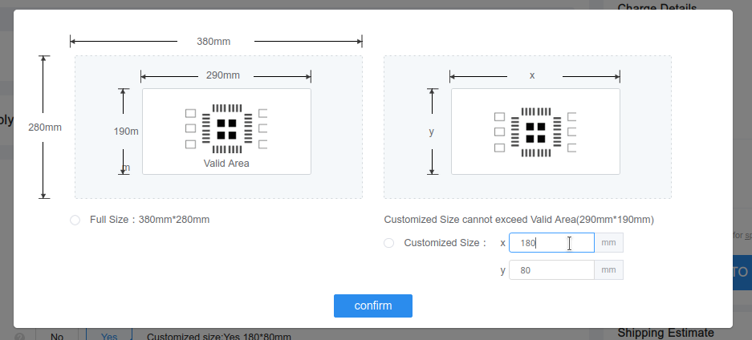
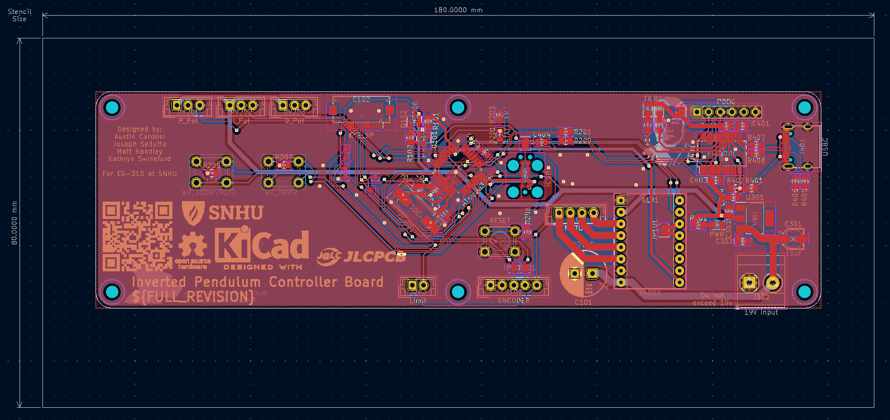
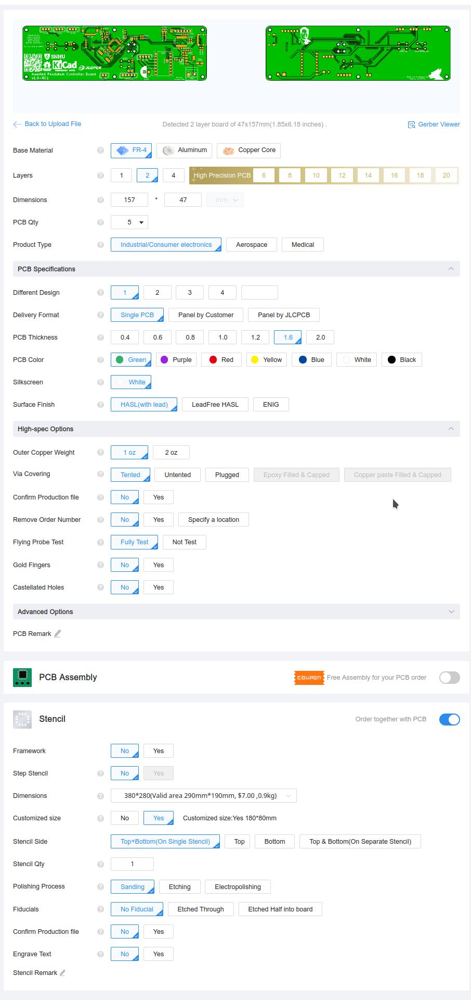

Assembly
========

The Pendulum 328 is a prototype built from prototype parts with the primary goal of
being an educational tool.

Should parts ever need to be re-ordered, or this process used to drive future projects,
this section of the documentation details those processes!

Ordering the PCB
----------------

The Pendulum 328's CI/CD will automatically attach new builds of the gerber files to each release,
when ordering new boards, always use the release tagged Latest_. (Not necessarily the release in the photo.)

This guide will use JLCPCB_ for ordering the boards, but we also build gerbers for PCBWay_ as well.

From the assets section at the bottom of the release, there should be two or more gerber zip files with each
fab's name and the **Commit Hash** for this build. Download the appropriate one for your fab. (In this case, JLCPCB_)

Right on the front page there is a box to upload your gerber .zip file. JLC will take you to the ordering and qouting page.

There are a few important settings we **MUST** change here.

Scroll to the bottom of the ordering page and find the stencil section.

This board uses SMD components and requires a stencil.

To save on cost and reduce shipping time, the stencil size must be modified, after **checking the toggle**
to enable the stencil, find and click the **Customized size** button, and input `180mmx80mm`.

This stencil size is perfectly adequate the cover the board, and can be found within the `User.Drawings`
layer in KiCAD.

All Other defaults should be acceptable, and at the end the order should look something like this:

Good luck!

.. _Latest: https://github.com/KenwoodFox/EG-310-InvertedPendulum/releases/latest
.. _JLCPCB: https://jlcpcb.com/
.. _PCBWay: https://www.pcbway.com/
